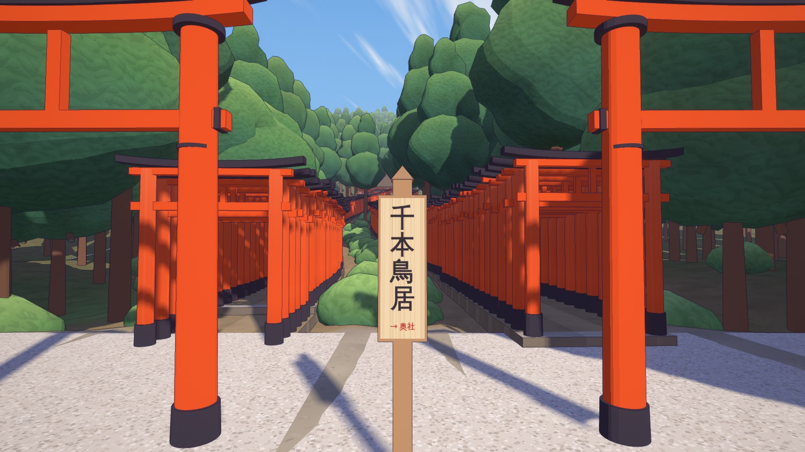
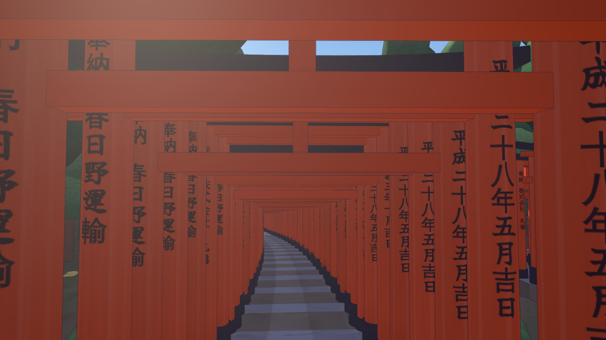
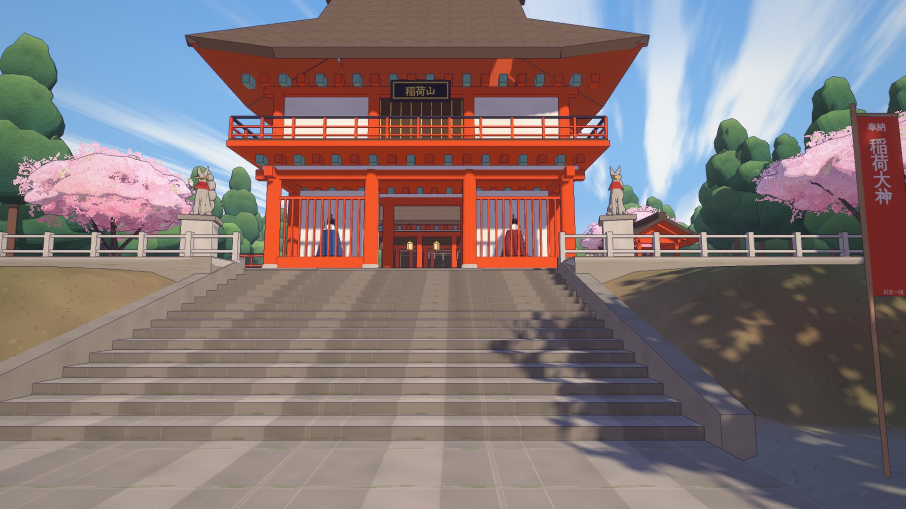
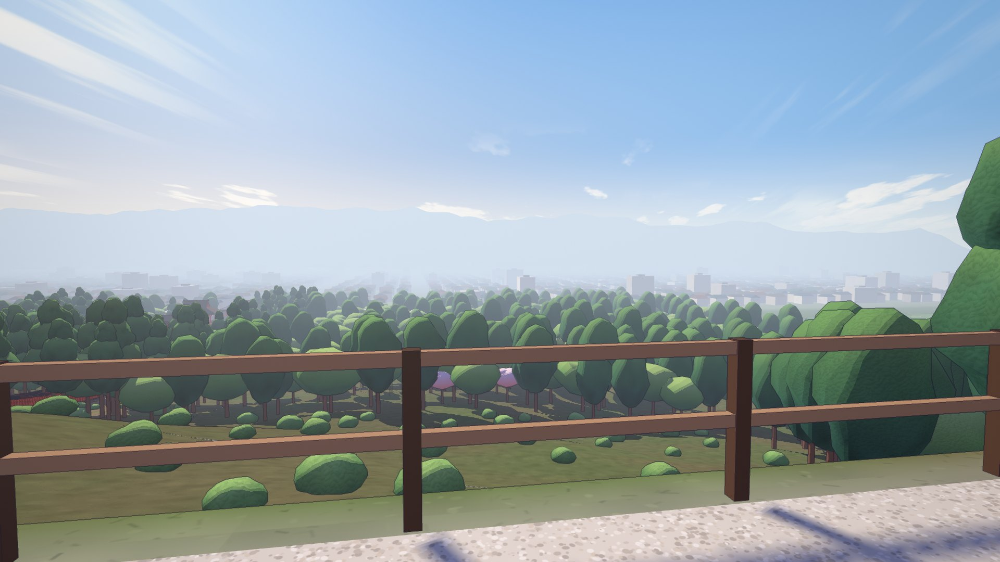
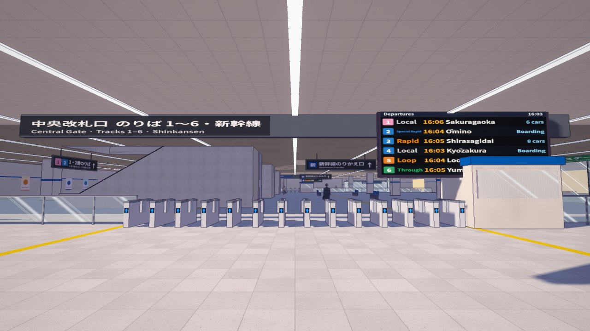
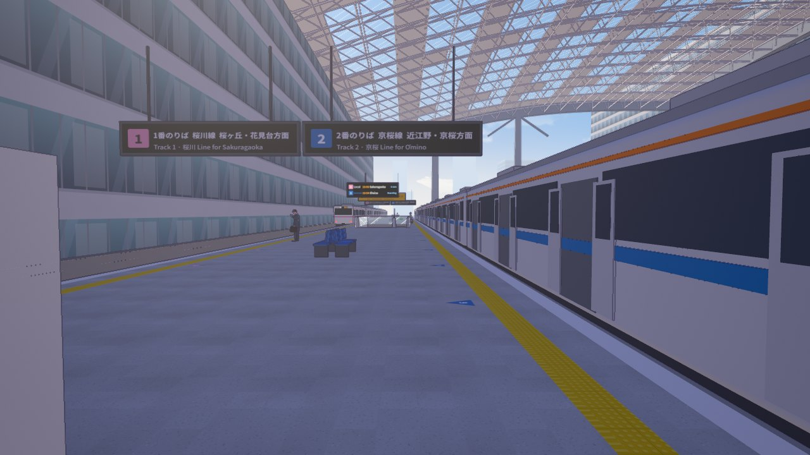
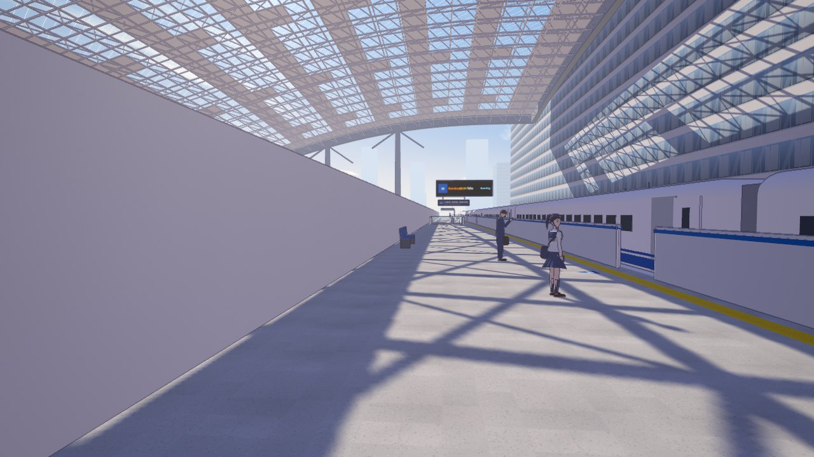
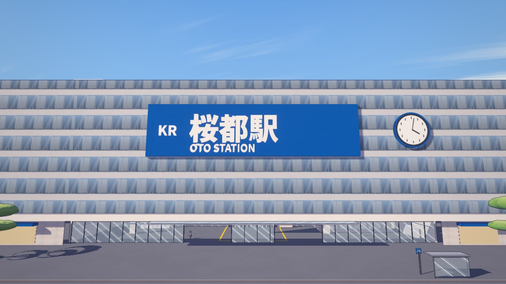

# 桜ヶ丘駅 · Sakuragaoka Station

A walkable, first-person **anime cel-shaded Japanese suburban sakura station** built with plain [three.js](https://threejs.org/) — no build step, no external 3D assets. Everything (buildings, trains, trees, signage, textures, sound) is generated procedurally in code.


| | |
|---|---|
|  |  |
|  |  |
|  |  |

**稲荷山 (Inariyama)** — a mountain shrine area modelled on Fushimi Inari Taisha:

| | |
|---|---|
|  |  |
|  |  |

**桜都駅 (Ōto Station)** — a big JR-style city terminal in the spirit of Osaka Station (fictional operator KR):

| | |
|---|---|
|  |  |
|  |  |

## Features

- **Cel-shaded look** – toon ramp materials, screen-space colour-aware outlines, blue-violet shadows, bloom, film grading, light leaks, painted sky with wind-stretched clouds.
- **A whole small town** – station building with a fully modelled interior and office, two platforms, a level crossing with working barriers and bells, a shopping street (konbini, café, flower shop, bookstore, wagashi shop, ramen shop, general store, bicycle shop — all enterable and furnished), houses, a shrine, a river levee lined with cherry trees, distant fields and mountains.
- **稲荷山 (Inariyama)** – a second walkable area modelled on Fushimi Inari Taisha: a shop-lined approach, the great torii, the two-storey 楼門 gate with key / jewel guardian foxes, the worship and main halls, the forked **千本鳥居** tunnels (~800 torii whose uphill faces carry black donor inscriptions you see on the way down), the 奥社 with fox-face ema, a torii-tunnel trail past 新池 and the tea houses up to the **四ツ辻** view over the city, and a summit loop past お塚 stone mounds — through cedar, bamboo and mountain-cherry woods. Pray at the town's little Inari shrine (or press 6) to go there; walk back out of the approach to return.
- **桜都駅 (Ōto Station)** – a third area: a big terminal modelled on JR Osaka Station. There is a ground-floor concourse with ticket machines, lockers, shops and 13 IC ticket gates. The gates beep like the real ones (one pip for an IC card, a double pip for a commuter pass, a triple pip for a low balance, and the occasional red-flap error). A blue 新幹線のりかえ口 transfer gate leads to the Shinkansen side. Stairs and moving escalators go up to three island platforms under a huge glass-and-truss dome, plus two Shinkansen platforms with platform-screen fences. Trains run on a fixed timetable: commuter EMUs in four liveries on tracks 1–6, 16-car Shinkansen that pull in and out on tracks 13/14, and non-stop Shinkansen that thunder through the middle tracks. The station has 駅名標, hanging track signs, live LCD departure boards (JP/EN), passengers and staff doing 指差確認. Each island plays its own approach and departure melody (original compositions in the 発車メロディ style), with spoken Japanese approach, arrival and door-closing announcements and Shinkansen chimes. To get there, ride train A: step through an open door at Sakuragaoka platform 1, or press 7. Board the 桜川線 train on track 1 to ride home.
- **Living scene** – two trains on a 2-minute timetable (arrive, open doors, depart through the crossing), falling petals with wind and train gusts, petal drifts and petal rafts on the river, townspeople, cats and sparrows.
- **Synthesized audio** – wind, birds, crossing bell, train motors and rail joints, door chimes, departure / approach melodies, IC gate beeps, Shinkansen run-by, station crowd, and Japanese announcements through the browser's speech synthesis. It is all WebAudio, with no sound files.
- **Performance** – automatic static batching (vertex-colour material merging + texture atlasing); ~4 M triangles at 60+ fps on a desktop GPU.

## Run

Serve the folder with any static file server, e.g. the bundled one:

```bash
node tools/serve.mjs
```

Then open <http://localhost:5173>. An internet connection is needed for three.js and fonts (loaded from jsDelivr / Google Fonts). Any static file server works too — ES modules just need to be served over HTTP, not `file://`.

### Controls

| Key | Action |
|---|---|
| Mouse | Look (click to lock pointer) |
| W A S D / arrows | Walk |
| Shift | Run |
| Space | Jump |
| F | Toggle fly mode |
| 1 – 5 | Jump to Street / Plaza / Platform / Crossing / Levee |
| 6 | Travel to 稲荷山 — or stand still for a moment facing the little hokora of the Inari shrine on the main street; walk back out of the approach (west) to return |
| 7 | Travel to 桜都駅 — or step through an open door of the train at Sakuragaoka platform 1; board the 桜川線 train on track 1 (1番のりば) there to ride back |
| R | Back to the start of the shopping street |
| H | Hide UI |
| M | Mute |

Touch: drag the left side to walk, the right side to look. Graphics quality can be changed in the top-right corner.

## Project layout

```
index.html              entry page (import map → three@0.170.0 on jsDelivr)
src/main.js             bootstrap, module loading, main loop, HUD
src/core/               renderer & post-processing, toon materials, sky & lights,
                        physics, first-person player, batching, wires, audio
src/world/layout.js     world contract: coordinates, roads, lots, spots, timetable
src/world/<module>.js   scene modules: environment, street, poles, railway, station, plaza,
                        shopsA, shopsB, houses, sakura, trains, crossing, props,
                        vehicles, characters, petals, inari, terminal (+ helper folders of the same name)
src/world/inari/        稲荷山: plan.js (pure terrain / paths / stairs, used by layout.heightAt),
                        terrain, paths, torii, arch (roofs), shrine, town, mountain, forest, props
src/world/terminal/     桜都駅: plan.js (pure layout + timetable), structure, roof, gates, furniture,
                        signs, trains, city, ops (melodies / announcements), people, tex, mats
src/world/lib/          shared generators (smooth cel-shaded foliage)
tools/                  dev server, headless checks & screenshots
docs/DESIGN.md          architecture / module contract
```

### Development tools

```bash
npm install                       # three + puppeteer-core, only needed for the tools below
node tools/check.mjs station      # headless build check of one or more modules (no GPU)
node tools/shot.mjs --cams "1.6,34,4,2" --out shots/test --t 22   # GPU screenshots via headless Edge/Chrome
                                  # (Linux: Chromium from CHROME_PATH or /usr/bin/chromium, SwiftShader)
node tools/audio-test.mjs         # offline render test of every synthesized sound
```

URL parameters: `?only=station,plaza` (build a subset; `?only=inari` builds just 稲荷山 — press 6 to go there), `?t=40` (start time), `?q=medium` (quality), `?stats` (fps counter), `?fly`.

## License

[MIT](LICENSE). All brands, stations and place names in the scene are fictional.
